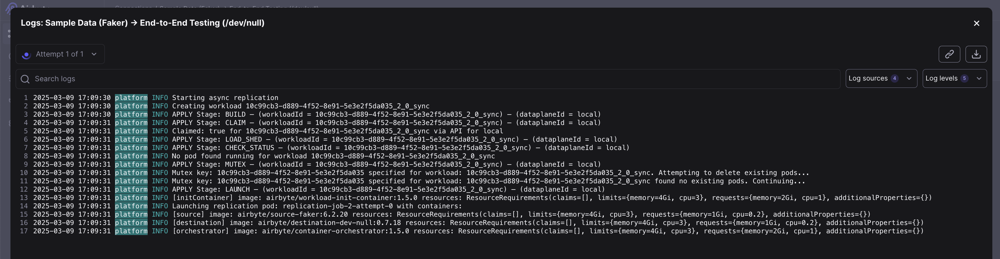
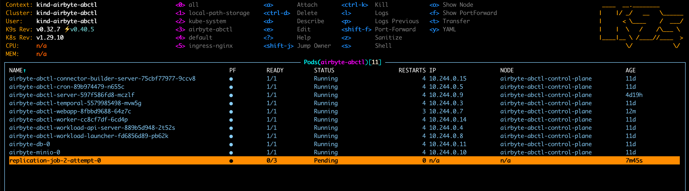

## What information might be useful when asking for help?

There are many details related to Airbyte that might be useful when asking for help. Providing more context speeds up a process of a solving your problem.
Consider including things in your questions from a list below:
* Airbyte version
* installation methods: `abctl`? helm chart on Kubernetes? old `run-ab-platform.sh` script or docker-compose?
* operating system
* for connections, versions of source and destination connectors
* versions of connectors
* connector type: no-code, low-code, Python CDK?
* available resources on machine (VM, EC2 instance, etc.): memory (RAM) / CPU (cores, vCPU)
* executed commands with options
* custom `values.yaml`
* details about load balancers (Connection idle timeout, HTTP client keepalive duration for AWS load balancers), reverse proxy
* logs, stacktraces
* and more...

## Debugging Airbyte deployed by `abctl`

On machine where you have your Airbyte deployed, install [kubectl](https://kubernetes.io/docs/tasks/tools/#kubectl) and [kubectx + kubens](https://github.com/ahmetb/kubectx) and [k9s](https://k9scli.io/)
then execute commands:

```bash
mkdir -p ~/.kube
KUBECONFIG=~/.airbyte/abctl/abctl.kubeconfig kubectl config view --flatten > ~/.kube/config
kubectx kind-airbyte-abctl
kubens airbyte-abctl
k9s
```

## Debugging Airbyte deployed by `helm` on Kubernetes cluster

On your local machine or any machine that has access to Kubernetes cluster with Airbyte, install [kubectl](https://kubernetes.io/docs/tasks/tools/#kubectl) and [kubectx + kubens](https://github.com/ahmetb/kubectx) and [k9s](https://k9scli.io/)
then execute commands:

```bash
kubens airbyte # change namespace where your Airbyte is deployed
k9s
```

## Connecting to Airbyte database (Airbyte deployed by `abctl`)

On machine where you have your Airbyte deployed, install [kubectl](https://kubernetes.io/docs/tasks/tools/#kubectl) and [kubectx + kubens](https://github.com/ahmetb/kubectx) and [k9s](https://k9scli.io/)
then execute commands:

```bash
mkdir -p ~/.kube
KUBECONFIG=~/.airbyte/abctl/abctl.kubeconfig kubectl config view --flatten > ~/.kube/config
kubectx kind-airbyte-abctl
kubens airbyte-abctl
kubectl port-forward airbyte-db-0 5432:5432
```

Now you can connect to your Airbyte database via `localhost:5432`, e.g. `psql -h localhost -p 5432 -U airbyte -d db-airbyte`

## Connecting to Airbyte database (Airbyte deployed by `helm`)

On machine where you have your Airbyte deployed, install [kubectl](https://kubernetes.io/docs/tasks/tools/#kubectl) and [kubectx + kubens](https://github.com/ahmetb/kubectx) and [k9s](https://k9scli.io/)
then execute commands:

```bash
kubens airbyte
kubectl port-forward airbyte-db-0 5432:5432
```

Now you can connect to your Airbyte database via `localhost:5432`, e.g. `psql -h localhost -p 5432 -U airbyte -d db-airbyte`

## Hanging sync

If you have hanging sync like this


```
2025-03-09 17:09:31 platform INFO APPLY Stage: LAUNCH — (workloadId = 10c99cb3-d889-4f52-8e91-5e3e2f5da035_2_0_sync) — (dataplaneId = local)
2025-03-09 17:09:31 platform INFO [initContainer] image: airbyte/workload-init-container:1.5.0 resources: ResourceRequirements(claims=[], limits={memory=4Gi, cpu=3}, requests={memory=2Gi, cpu=1}, additionalProperties={})
2025-03-09 17:09:31 platform INFO Launching replication pod: replication-job-2-attempt-0 with containers:
2025-03-09 17:09:31 platform INFO [source] image: airbyte/source-faker:6.2.20 resources: ResourceRequirements(claims=[], limits={memory=4Gi, cpu=3}, requests={memory=1Gi, cpu=0.2}, additionalProperties={})
2025-03-09 17:09:31 platform INFO [destination] image: airbyte/destination-dev-null:0.7.18 resources: ResourceRequirements(claims=[], limits={memory=4Gi, cpu=3}, requests={memory=1Gi, cpu=0.2}, additionalProperties={})
2025-03-09 17:09:31 platform INFO [orchestrator] image: airbyte/container-orchestrator:1.5.0 resources: ResourceRequirements(claims=[], limits={memory=4Gi, cpu=3}, requests={memory=2Gi, cpu=1}, additionalProperties={})
```

And `k9s` screenshot looks like this:



And `kubectl describe pod replication-job-...` looks like this:

```
Events:
  Type     Reason            Age                    From               Message
  ----     ------            ----                   ----               -------
  Warning  FailedScheduling  14m                    default-scheduler  0/1 nodes are available: 1 Insufficient cpu. preemption: 0/1 nodes are available: 1 No preemption victims found for incoming pod.
  Warning  FailedScheduling  4m34s (x2 over 9m34s)  default-scheduler  0/1 nodes are available: 1 Insufficient cpu. preemption: 0/1 nodes are available: 1 No preemption victims found for incoming pod.
```

That means that you don't have enough resources on your machine.

Let's sum up requests to know how much resources is needed

```
[initContainer] ... requests={memory=2Gi, cpu=1}
[source] ... requests={memory=1Gi, cpu=0.2}
[destination] ... requests={memory=1Gi, cpu=0.2}
[orchestrator] ... requests={memory=2Gi, cpu=1}

requests={memory=6Gi, cpu=2.4}
```

As you can notice at least 6GB of RAM and 2.4 cores/vCPU are needed.

:warning: Keep in mind that there are other Airbyte components are running, so you need even more resources. Also, different source and destination may need different amount of resources.

**Solutions**

1. Machine with more resources (the easiest, works best, long-term solution)
2. For `abctl local install ...` add `--low-resource-mode` flag (`abctl` only :warning:)
3. Adjust requests/limits for jobs and other Airbyte components in `values.yaml` (requires experiments and calculations to find the most effective values). Check Slack thread https://airbytehq.slack.com/archives/C021JANJ6TY/p1728564196843469?thread_ts=1728561176.853139&cid=C021JANJ6TY

**References**

[Understand Airbyte > Workloads & Jobs](https://docs.airbyte.com/understanding-airbyte/jobs)
